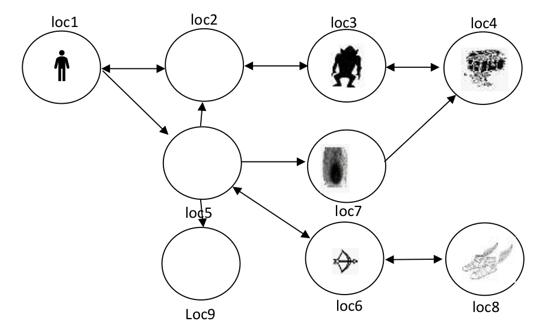
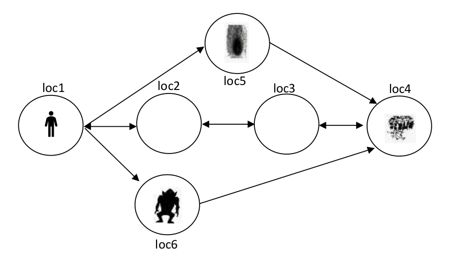

# Hero-in-cave-network-planning
Σχεδίαση ορισμών πεδίων για εύρεση πλάνων λύσης στιγμιότυπων του προβλήματος εύρεσης μονοπατιού του ήρωα (του προβλήματος) για έξοδο από την σπηλιά μετά την απόκτηση θησαυρών. 

## Περιγραφή προβλήματος
Έστω ένα παιχνίδι με έναν ήρωα ο οποίος μπαίνει μέσα σε ένα δίκτυο από σπηλιές με σκοπό να βρει
θησαυρούς και να τους μεταφέρει έξω από το δίκτυο.  
Το παιχνίδι ξεκινάει με τον ήρωα να βρίσκεται στην πρώτη σπηλιά (π.χ. loc1) και τερματίζει όταν ο ήρωας
βρεθεί ξανά στην ίδια θέση (loc1) έχοντας όμως μαζί του όλους τους θησαυρούς που υπάρχουν κρυμμένοι
στο δίκτυο.  
Κάθε σπηλιά μπορεί να επικοινωνεί με άλλες σπηλιές μέσω περασμάτων, που όμως δεν είναι απαραίτητα
διπλής κατεύθυνσης. Έτσι μπορεί μια σπηλιά (π.χ. η loc5) να έχει περάσματα διπλής κατεύθυνσης ώστε να
μεταβεί ο ήρωας σε άλλες γειτονικές σπηλιές (π.χ. loc7) και αν θέλει μετά να επιστρέψει, αλλά μπορεί όμως
να έχει και περάσματα μίας κατεύθυνσης που οδηγούν σε σπηλιές (π.χ. loc7, loc2, loc5) χωρίς τη δυνατότητα
άμεσης επιστροφής.  
Σε ορισμένες σπηλιές (π.χ. loc7) υπάρχουν μέσα λάκκοι από τους οποίους ο ήρωας δεν μπορεί να
δραπετεύσει. Έτσι αν ο ήρωας περπατήσει από μια σπηλιά (π.χ. loc5) σε μία άλλη (π.χ. loc7) που έχει λάκκο,
τότε ο ήρωας θα παγιδευτεί και το παιχνίδι τελειώνει με ήττα.  
Ακόμη, σε ορισμένες σπηλιές (π.χ. loc3) υπάρχουν μέσα τέρατα και αν ο ήρωας μπει μέσα στη σπηλιά που
ζει ένα τέρας, τότε αυτό θα τον σκοτώσει και το παιχνίδι θα τελειώσει με ήττα.  
Για να αντιμετωπίσει ο ήρωας τα τέρατα και τους λάκκους, μπορεί να υπάρχουν σε ορισμένες σπηλιές (π.χ.
loc6 ή loc8) όπλα και/ή μαγικά παπούτσια. Αυτά μπορεί να τα συλλέξει ο ήρωας και να τα χρησιμοποιήσει
όταν τα χρειαστεί. Μα τα μαγικά παπούτσια π.χ. μπορεί να πετάξει πάνω από τον λάκκο που υπάρχει μέσα
σε μια σπηλιά και να βρεθεί σε αυτή με ασφάλεια ώστε να συνεχίσει τη περιπλάνηση του (π.χ. θα μπορούσε
ο ήρωας αν διαθέτει μαγικά παπούτσια να πετάξει από το loc5 στο loc7 και μετά να περπατήσει από το loc7
στο loc4). Με ένα όπλο μπορεί ο ήρωας να σκοτώσει ένα τέρας από μια γειτονική σπηλιά (π.χ. loc2) και μετά
να μπει στη σπηλιά με ασφάλεια. Τα όπλα μπορούν να χρησιμοποιηθούν μόνο από γειτονικές σπηλιές, πουέχουν απευθείας πέρασμα στη σπηλιά του τέρατος (π.χ. μπορεί να χρησιμοποιηθεί από το loc2 ή το loc4
και μόνο από αυτά). Τόσο τα όπλα όσο και τα μαγικά παπούτσια μπορούν να χρησιμοποιηθούν από μία
φορά το καθένα (π.χ. για να σκοτώσουν ένα τέρας ή να περάσουν έναν λάκκο). Αν στο δίκτυο υπάρχουν
παραπάνω τέρατα ή παραπάνω λάκκοι τότε ο ήρωας θα πρέπει να βρει περισσότερα από ένα όπλα ή
παπούτσια αντίστοιχα.

***

**Σχήμα 1**. Πρόβλημα Monster2.

**Σχήμα 2**. Πρόβλημα Monster1.

**Σχήμα 3**. Πρόβλημα Monster3.

***

## Ζητούμενα:
* Να γίνει ανάλυση της οικογένειας προβλημάτων (πεδίο) του συγκεκριμένου παιχνιδιού. Η ανάλυση θα
πρέπει να αναφέρει τα εξής: οντότητες, σχέσεις, τελεστές μετάβασης (όνομα, παράμετροι, προϋποθέσεις,
λίστα προσθήκης, λίστα διαγραφής) για το πεδίο.
* Να γραφούν το πεδίο και τα προβλήματα (Monster1, Monster2 και Monster3) σε γλώσσα PDDL.
* Να λύσετε τα παραπάνω προβλήματα και να καταγράψετε για κάθε ένα το πλάνο (συνολικό μήκος και
αναφορά των βημάτων) καθώς και το χρόνο που χρειάστηκε για την επίλυση του.